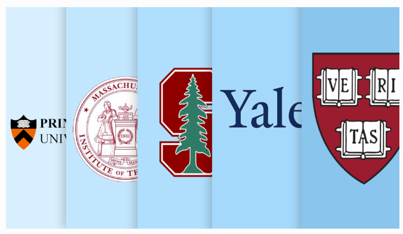

## Problem Statement:

### Objective:
The objective of the Forbes College Explorer is to utilize a Python program to explore and analyze Forbes Magazine's annual list of America's best colleges. This tool aims to provide a user-friendly platform for students and families to make informed decisions by facilitating exploration and comparison of colleges based on various criteria such as academic performance, experiences, career success, and debt levels.

*Picture reference: [forbes-releases-annual-ranking-of-americas-top-colleges](https://imageio.forbes.com/specials-images/imageserve/5d55764795808800097ce87e/Top-Colleges/960x0.png?format=png&width=1440)*

### Functionality:

1. **Exploration:**
   - Allow users to explore Forbes Magazine's annual list of America's best colleges.
   - Implement search functionality for colleges based on specific criteria.
   - Facilitate comparison of colleges across different parameters.

2. **Python Utilization:**
   - Leverage Python's capabilities for efficient data handling and analysis.
   - Ensure the implementation of user-friendly and interactive features.
     
### Data Presentation:

1. **Insights:**
   - Present Forbes rankings in a meaningful and digestible format.

### User Assistance:

1. **Informed Decisions:**
   - Assist students and families in making informed decisions.
   - Offer a data-driven approach to navigating the crucial process of choosing a four-year college.

## Data Analysis Summary:

### Institutional Information:

- **Institution Types:**
  - Private Colleges: 384
  - Public Colleges: 244

- **Colleges in Different Cities:**
  - New York, NY: 14 colleges
  - Boston, MA: 7 colleges
  - Atlanta, GA: 6 colleges
  - Los Angeles, CA: 6 colleges
  - Baltimore, MD: 5 colleges

- **Institution Counts:**
  - Non-University (College and Technological Institutions): 11
  - Universities or Colleges or Technological Institutions: 617

### Admissions and Acceptance:

- **Overall Acceptance Rate:**
  - Overall Acceptance Rate: 61.72%

- **Top 5 Colleges with Lowest Acceptance Rates:**
  - Harvard University: 5.0%
  - Stanford University: 5.0%
  - Princeton University: 6.0%
  - The Juilliard School: 6.0%
  - Yale University: 7.0%

### Financial Information:

- **Average Net Price with Grants:**
  - Average Net Price with Grants: $22,481 USD

- **College with Highest Average Grant Aid:**
  - Yale University
  - Average Grant Aid: $50,897.0 USD

### Student Population and Costs:

- **Average Undergraduate Population:**
  - Average Undergraduate Population: 10,235.47

- **College with Highest Student Population:**
  - Liberty University

- **College with Highest Total Annual Cost:**
  - University of Chicago

### Alumni Salaries:

- **Average Alumni Salary:**
  - Average Alumni Salary: $98,616.24

- **Colleges with Highest Alumni Salaries:**
  1. Harvey Mudd College - $158,200.0
  2. Massachusetts Institute of Technology (MIT) - $155,200.0
  3. California Institute of Technology (Caltech) - $151,600.0
  4. Harvard University - $146,800.0
  5. Stanford University - $145,200.0

- **Colleges with Lowest Alumni Salaries:**
  1. Berea College - $71,600.0
  2. College of the Ozarks - $71,100.0
  3. Converse College - $71,000.0
  4. Asbury University - $70,800.0
  5. Emory & Henry College - $70,700.0

---

## Conclusion:

The Forbes College Explorer is designed to empower users with valuable insights into various aspects of colleges, aiding them in making informed decisions about their educational journey. By leveraging Python's analytical capabilities, the tool provides basic operations for exploring Forbes' annual college rankings and related data.
